# PortalApp

PortalApp, kullanıcıların sisteme üye olabildiği, giriş yapabildiği, şifresini yenileyebildiği, makale işlemlerini gerçekleştirebildiği ve profil yönetimi yapabildiği JSP/Servlet tabanlı bir web uygulamasıdır.

Bu proje; JSP, Servlet, JDBC, MySQL ve Apache Tomcat kullanılarak geliştirilmiştir.

---

## Proje Amacı

Bu proje, kullanıcı üyelik sistemi, oturum yönetimi, makale işlemleri ve profil yönetimi mantığını öğrenmek amacıyla geliştirilmiş bir dinamik web uygulamasıdır.

Kullanıcılar sisteme kayıt olabilir, giriş yapabilir, profil sayfasını yönetebilir ve giriş yaptıktan sonra kendi makaleleri üzerinde işlem gerçekleştirebilir.

---

## Özellikler

Bu projede aşağıdaki işlemler gerçekleştirilebilmektedir:

- Üye kayıt olma
- Üye girişi yapma
- Çıkış yapma
- Şifre yenileme
- Profil sayfasını görüntüleme
- Profil resmi yükleme
- Profil resmi silme
- Navbar üzerinde profil avatarı gösterme
- Makale ekleme
- Makale listeleme
- Makale detay görüntüleme
- Okunma sayısı artırma
- Makale güncelleme
- Makale silme
- Session tabanlı kullanıcı kontrolü

---

## Kullanılan Teknolojiler

- Java
- JSP
- Servlet
- JDBC
- MySQL
- Apache Tomcat 10.1
- Eclipse IDE
- HTML5
- CSS3
- Bootstrap 5

---

## Veritabanı Yapısı

Projede `portalapp_db` isimli bir MySQL veritabanı kullanılmaktadır.

### users tablosu

`users` tablosu kullanıcı bilgilerini tutar.

Bu tabloda kullanılan temel alanlar:

- `id`
- `fullname`
- `email`
- `password`
- `profile_image`

### articles tablosu

`articles` tablosu makale bilgilerini tutar.

Bu tabloda kullanılan temel alanlar:

- `id`
- `user_id`
- `title`
- `content`
- `view_count`

### Tablolar Arasındaki İlişki

Bu projede kullanıcılar ile makaleler arasında bire-çok ilişki bulunmaktadır.

- Bir kullanıcı birden fazla makale ekleyebilir.
- Her makale yalnızca bir kullanıcıya aittir.
- `articles.user_id` alanı, `users.id` alanı ile ilişkilidir.

### Profil Resmi Yapısı

Projede kullanıcıların profil resmi bilgisi `users` tablosundaki `profile_image` alanında tutulmaktadır.

Bu yapı sayesinde:

- Kullanıcı profil resmi yükleyebilir.
- Yüklenen resmin dosya adı veritabanında saklanır.
- Profil sayfasında mevcut resim görüntülenebilir.
- Kullanıcı isterse profil resmini silebilir.
- Navbar üzerinde küçük profil avatarı gösterilebilir.

---

## Veritabanı Kurulum Komutları

Aşağıdaki SQL komutlarını MySQL Workbench üzerinde çalıştırabilirsiniz:

```sql
CREATE DATABASE portalapp_db CHARACTER SET utf8mb4 COLLATE utf8mb4_unicode_ci;

USE portalapp_db;

CREATE TABLE users (
    id INT PRIMARY KEY AUTO_INCREMENT,
    fullname VARCHAR(100) NOT NULL,
    email VARCHAR(100) NOT NULL UNIQUE,
    password VARCHAR(255) NOT NULL,
    profile_image VARCHAR(255) NULL
);

CREATE TABLE articles (
    id INT PRIMARY KEY AUTO_INCREMENT,
    user_id INT NOT NULL,
    title VARCHAR(200) NOT NULL,
    content TEXT NOT NULL,
    view_count INT DEFAULT 0,
    FOREIGN KEY (user_id) REFERENCES users(id) ON DELETE CASCADE
);
```

### Profil resmi alanı sonradan eklenecekse

```sql
ALTER TABLE users
ADD COLUMN profile_image VARCHAR(255) NULL;
```

---

## Gerekli Yazılımlar

Projeyi çalıştırabilmek için aşağıdaki yazılımlar gereklidir:

- JDK 21
- Eclipse IDE for Enterprise Java and Web Developers
- Apache Tomcat 10.1
- MySQL Server
- MySQL Workbench

---

## Kurulum Adımları

### 1. Projeyi Eclipse'e ekleyin

Projeyi Eclipse IDE üzerinde Dynamic Web Project yapısında açın.

### 2. Tomcat Server ekleyin

Apache Tomcat 10.1 sunucusunu Eclipse içine tanımlayın ve projeyi bu server'a bağlayın.

### 3. MySQL veritabanını oluşturun

Yukarıda verilen SQL komutları ile `portalapp_db` veritabanını ve tabloları oluşturun.

### 4. JDBC Driver kontrolü yapın

Projede MySQL JDBC sürücüsü aşağıdaki klasörde bulunmaktadır:

```text
src/main/webapp/WEB-INF/lib/mysql-connector-j-9.6.0.jar
```

### 5. Veritabanı bağlantısını düzenleyin

`DBConnection.java` dosyasındaki bağlantı bilgilerini kendi sisteminize göre ayarlayın.

Örnek bağlantı yapısı:

```java
private static final String URL = "jdbc:mysql://localhost:3306/portalapp_db?useSSL=false&allowPublicKeyRetrieval=true&serverTimezone=UTC";
private static final String USER = "root";
private static final String PASSWORD = "SIFRENIZ";
```

### 6. Projeyi çalıştırın

Projeyi Tomcat üzerinden başlatın ve tarayıcıdan şu adrese gidin:

```text
http://localhost:8080/PortalApp/
```

---

## Uygulama Sayfaları

Projede bulunan temel sayfalar şunlardır:

- `index.jsp` → Ana sayfa
- `register.jsp` → Kayıt sayfası
- `login.jsp` → Giriş sayfası
- `forgot-password.jsp` → Şifre yenileme sayfası
- `articles.jsp` → Makale listeleme sayfası
- `article-detail.jsp` → Makale detay sayfası
- `article-form.jsp` → Yeni makale ekleme sayfası
- `edit-article.jsp` → Makale güncelleme sayfası
- `profile.jsp` → Profil yönetim sayfası

---

## Servlet Yapısı

Projede kullanılan servlet sınıfları şunlardır:

- `RegisterServlet` → Kullanıcı kaydı
- `LoginServlet` → Kullanıcı girişi
- `LogoutServlet` → Çıkış işlemi
- `ForgotPasswordServlet` → Şifre güncelleme
- `AddArticleServlet` → Makale ekleme
- `UpdateArticleServlet` → Makale güncelleme
- `DeleteArticleServlet` → Makale silme
- `UploadProfileImageServlet` → Profil resmi yükleme
- `DeleteProfileImageServlet` → Profil resmi silme
- `ProfileImageServlet` → Profil resmini görüntüleme
- `TestDBServlet` → Veritabanı bağlantı testi

---

## Uygulamada Gerçekleştirilen İşlemler

### Kullanıcı İşlemleri

- Kullanıcı kayıt olabilir
- Kullanıcı sisteme giriş yapabilir
- Kullanıcı çıkış yapabilir
- Kullanıcı şifresini güncelleyebilir
- Kullanıcı profil sayfasını görüntüleyebilir
- Kullanıcı profil resmi yükleyebilir
- Kullanıcı profil resmini silebilir

### Makale İşlemleri

- Giriş yapan kullanıcı makale ekleyebilir
- Sistemdeki makaleler listelenebilir
- Makale detay sayfası görüntülenebilir
- Makale okunma sayısı artırılabilir
- Kullanıcı kendi makalesini güncelleyebilir
- Kullanıcı kendi makalesini silebilir

### Arayüz ve Oturum İşlemleri

- Session tabanlı kullanıcı kontrolü yapılır
- Giriş yapılmadan korumalı sayfalara erişim engellenir
- Profil bilgileri navbar üzerinde gösterilebilir
- Profil resmi varsa avatar olarak görüntülenir
- Profil resmi yoksa kullanıcı baş harfi gösterilir

---

## Proje Klasör Yapısı

```text
PortalApp
├─ README.md
├─ .classpath
├─ .project
├─ .gitignore
├─ .settings/
├─ build/
│  └─ classes/
│     ├─ controller/
│     │  ├─ AddArticleServlet.class
│     │  ├─ DeleteArticleServlet.class
│     │  ├─ DeleteProfileImageServlet.class
│     │  ├─ ForgotPasswordServlet.class
│     │  ├─ LoginServlet.class
│     │  ├─ LogoutServlet.class
│     │  ├─ ProfileImageServlet.class
│     │  ├─ RegisterServlet.class
│     │  ├─ TestDBServlet.class
│     │  ├─ UpdateArticleServlet.class
│     │  └─ UploadProfileImageServlet.class
│     └─ util/
│        └─ DBConnection.class
├─ src/
│  └─ main/
│     ├─ java/
│     │  ├─ controller/
│     │  │  ├─ AddArticleServlet.java
│     │  │  ├─ DeleteArticleServlet.java
│     │  │  ├─ DeleteProfileImageServlet.java
│     │  │  ├─ ForgotPasswordServlet.java
│     │  │  ├─ LoginServlet.java
│     │  │  ├─ LogoutServlet.java
│     │  │  ├─ ProfileImageServlet.java
│     │  │  ├─ RegisterServlet.java
│     │  │  ├─ TestDBServlet.java
│     │  │  ├─ UpdateArticleServlet.java
│     │  │  └─ UploadProfileImageServlet.java
│     │  └─ util/
│     │     └─ DBConnection.java
│     └─ webapp/
│        ├─ article-detail.jsp
│        ├─ article-form.jsp
│        ├─ articles.jsp
│        ├─ edit-article.jsp
│        ├─ forgot-password.jsp
│        ├─ index.jsp
│        ├─ login.jsp
│        ├─ profile.jsp
│        ├─ register.jsp
│        ├─ META-INF/
│        │  └─ MANIFEST.MF
│        └─ WEB-INF/
│           ├─ web.xml
│           └─ lib/
│              └─ mysql-connector-j-9.6.0.jar
```

---

## Kullanım Senaryosu

Projede temel kullanım akışı şu şekildedir:

1. Kullanıcı sisteme kayıt olur.
2. Kullanıcı giriş yapar.
3. Ana sayfaya yönlendirilir.
4. Profil sayfasına giderek profil resmini yükleyebilir.
5. Yeni makale ekleyebilir.
6. Makale listesinde içerikleri görüntüleyebilir.
7. Makale detay sayfasına girebilir.
8. Kendi makalelerini güncelleyebilir veya silebilir.
9. İsterse profil resmini silebilir.
10. Çıkış yaparak oturumu sonlandırabilir.

---

## Güvenlik Notu

Bu proje eğitim amaçlı geliştirilmiştir.

Şifreler doğrudan veritabanında tutulmaktadır. Gerçek projelerde:

- şifreler hashlenmelidir
- doğrulama mekanizmaları eklenmelidir
- yetkilendirme kontrolleri güçlendirilmelidir
- dosya yükleme işlemlerinde daha gelişmiş güvenlik kontrolleri uygulanmalıdır

---

## Geliştirme Önerileri

İleride projeye aşağıdaki özellikler eklenebilir:

- Şifrelerin hashlenmesi
- E-posta doğrulama sistemi
- Admin paneli
- Makale arama ve filtreleme
- Kategori sistemi
- Yorum sistemi
- Sayfalama yapısı
- Gelişmiş form doğrulamaları
- Profil düzenleme alanının genişletilmesi

---

## Geliştirici

**Furkan Mehmet Salgın**

---

## Lisans

Bu proje eğitim ve geliştirme amaçlı paylaşılmıştır.

## Ekran Görüntüleri

### Ana Sayfa
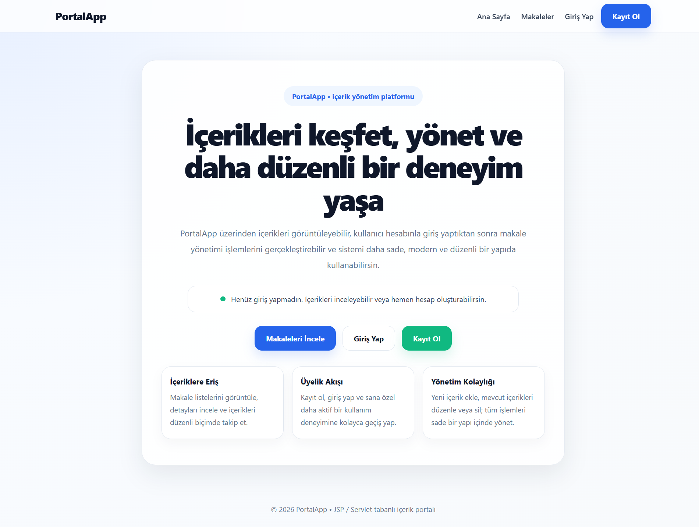

### Giriş Sayfası
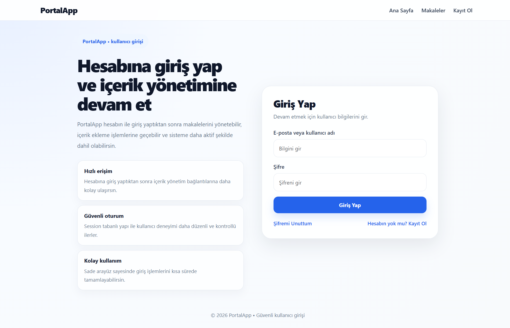

### Kayıt Ol Sayfası
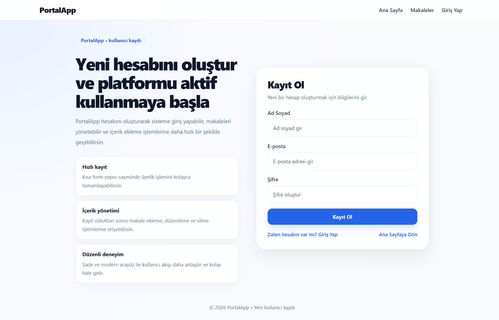

### Profil Sayfası
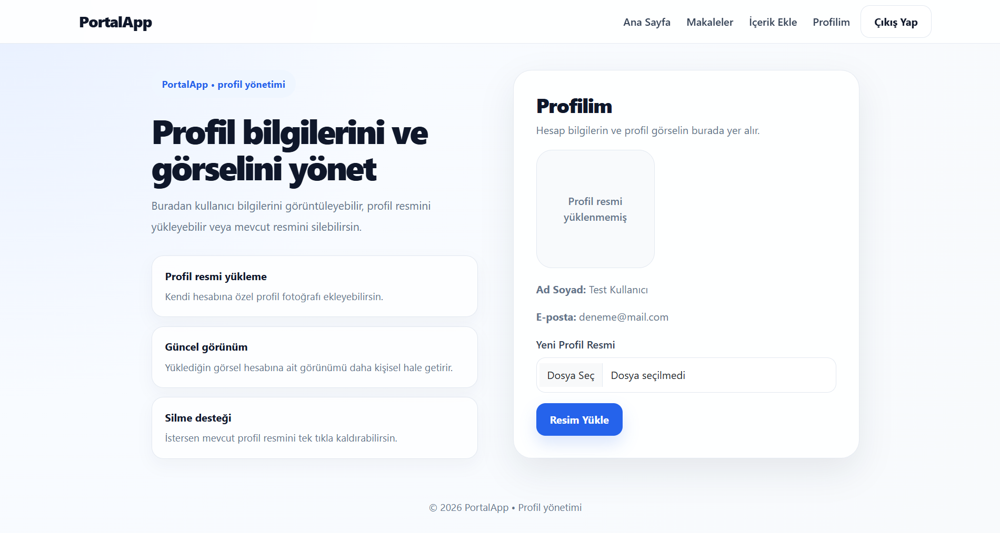

### Makale Listesi
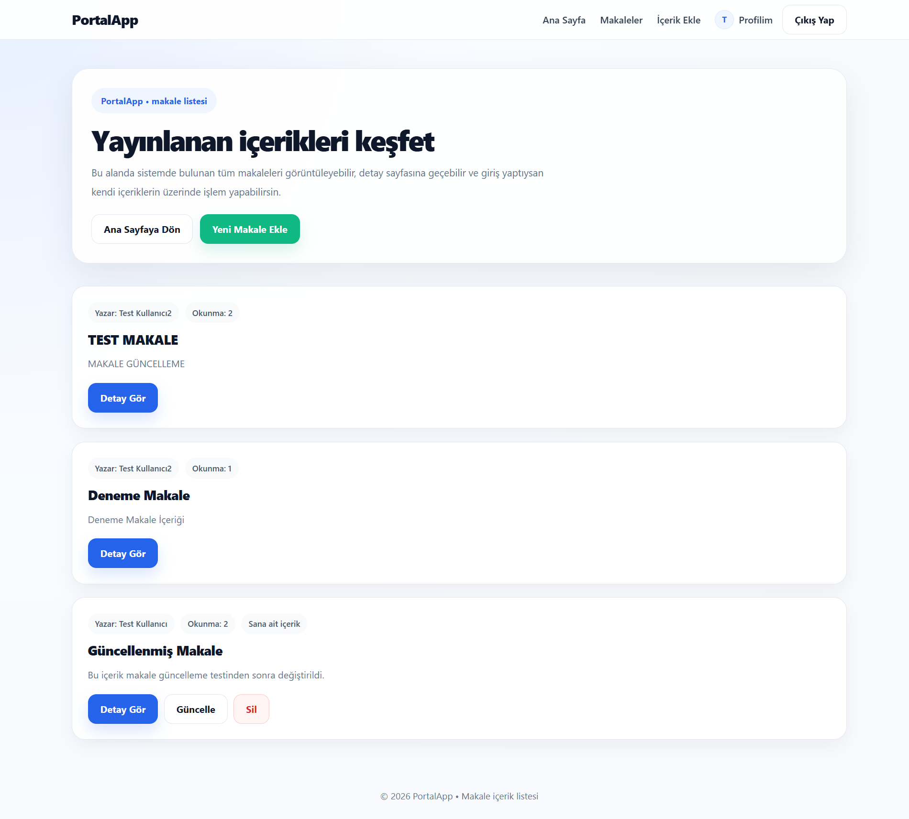

### Makale Detay Sayfası
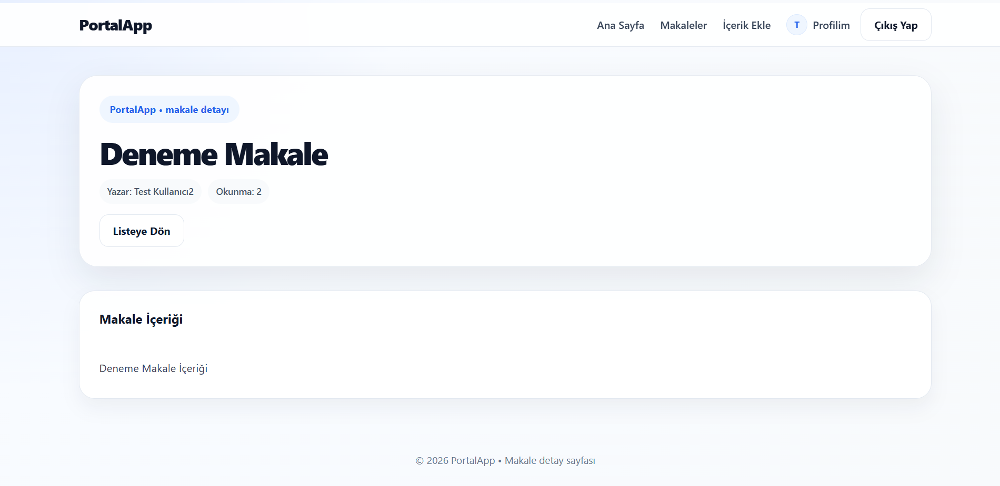

### Makale Ekleme Sayfası
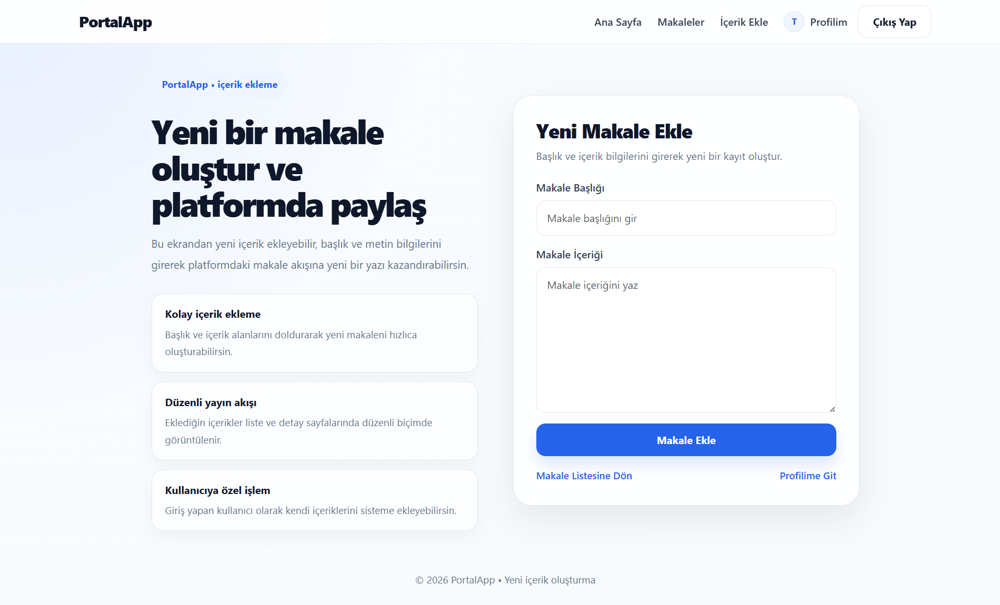

### Makale Güncelleme Sayfası
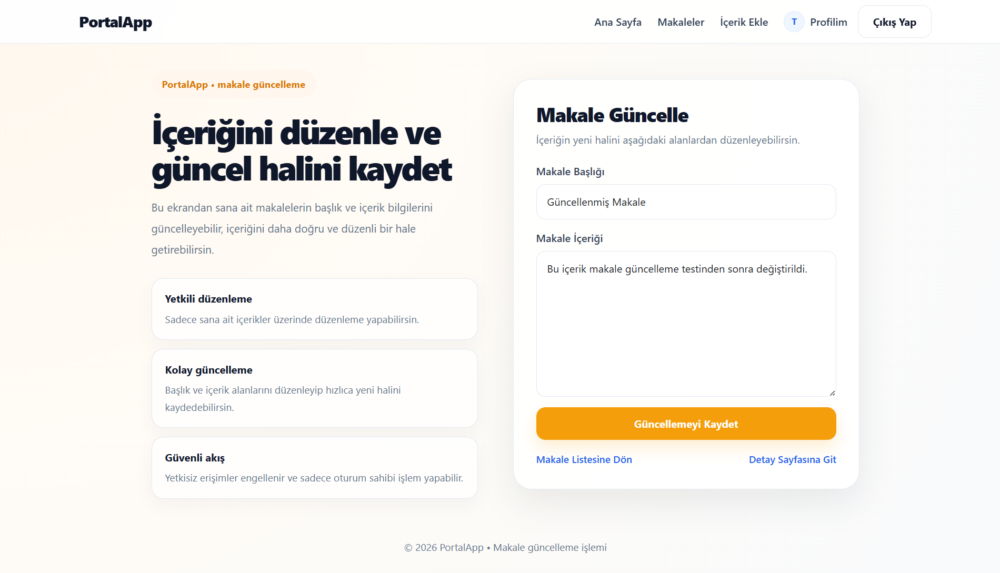

### Profil Resmi Yüklenmiş Hali
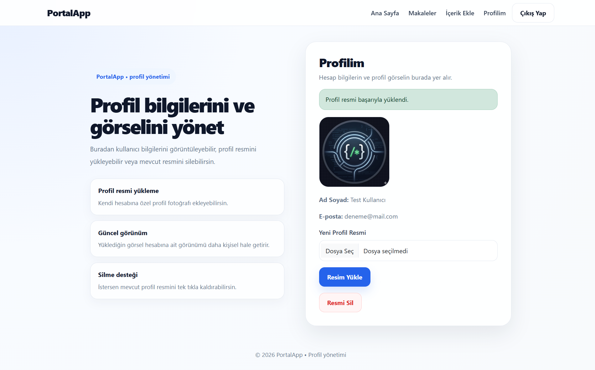

### Profil Resmi Yükleme Formu
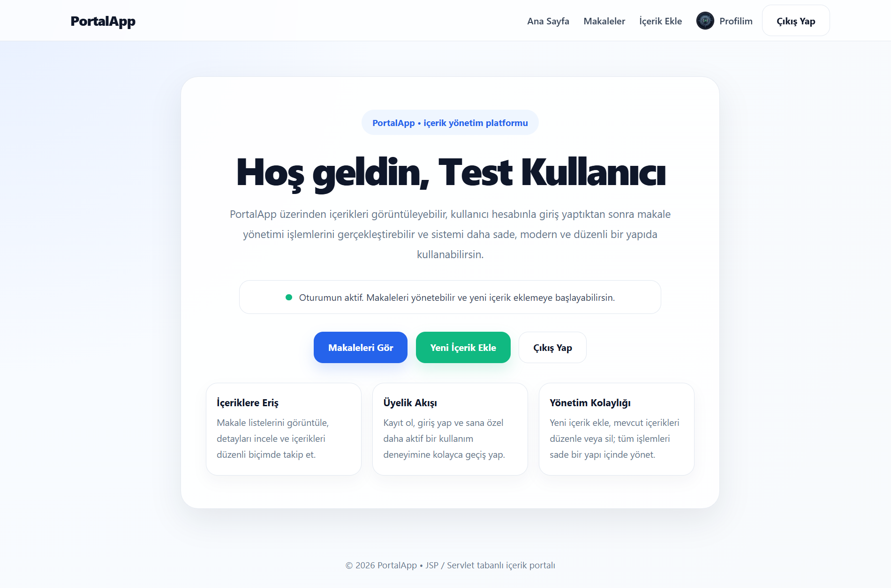

### Şifre Yenileme Sayfası
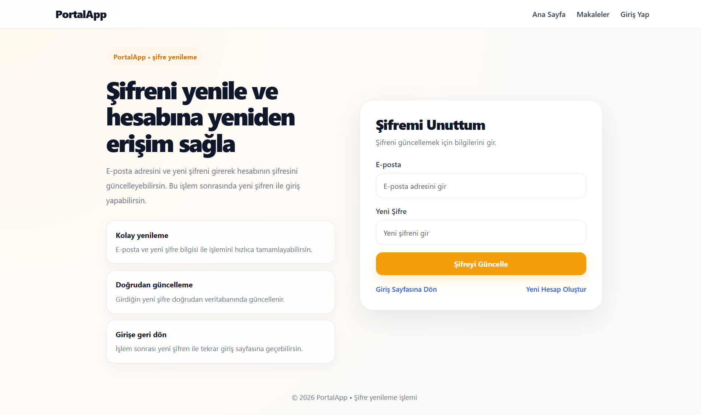